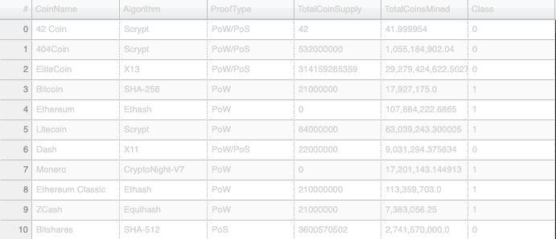

# Cryptocurrencies

## Overview of Analysis

A cryptocurrency is a digital or virtual currency that is secured by cryptography, which makes it nearly impossible to counterfeit or double-spend. Many cryptocurrencies are decentralized networks based on blockchain technology, a distributed ledger enforced by a disparate network of computers. A defining feature of cryptocurrencies is that they are generally not issued by any central authority, rendering them theoretically immune to government interference or manipulation

For my cryptocurrencies analysis I created a report that includes which cryptocurrencies are on the trading market and how they could be grouped to create a classification system for this new investment.  The data source that we are working with is not ideal, so we needed a process to fit the machine learning models. Since there is no known output, unsupervised learning would be the most logical method of machine learning. To group the cryptocurrencies, I used a clustering algorithm and data visualizations to share the findings.

## Results

First, I used the Pandas library to process the dataset in order to perform the Principal Component Analysis (PCA) algorithm.  Then I applied the Principal Component Analysis (PCA) algorithm, and reduced the dimensions of the x DataFrame to three principal components and placed the dimensions in a new DataFrame.  Using the K-means algorithm, I created an elbow curve using hvPlot to find the best value for K from the pcs_df DataFrame. Then, I ran the K-means algorithm to predict the K clusters for the cryptocurrencies’ data.  Finally, I created scatter plots with Plotly Express and hvPlot to visualize the distinct groups, then created a table with all the currently tradable cryptocurrencies using the hvPly.table() function.

Elbow Curve

Tradable Cryptocurrencies Table

2D Scatter Plot

3D Scatter Plot

